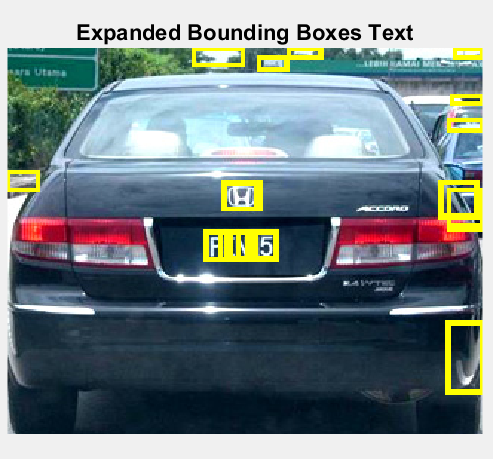
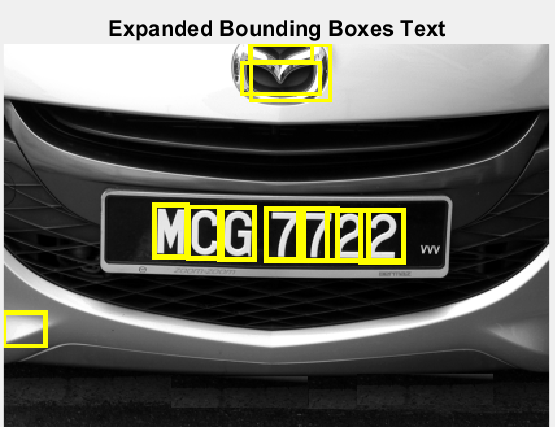
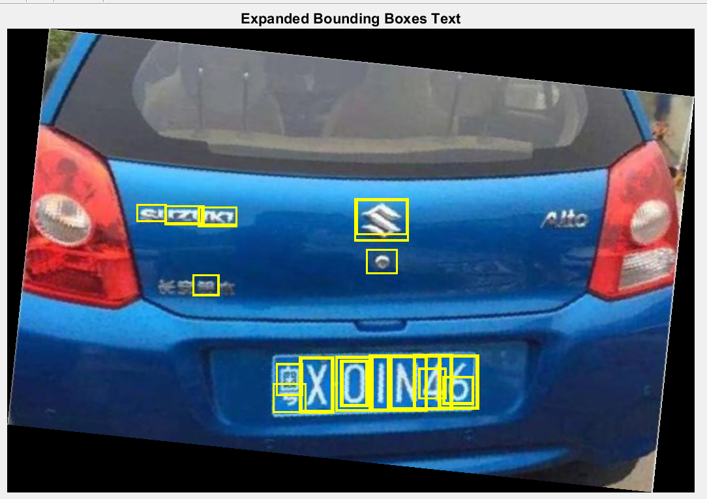

# computer-vision
## Vehicle License Plate Recognition and Detection

MATLAB program for the detection and extraction of text in natural images. the MSER and stroke width variation algorithms alongside OCR were used to detect and recognize text and characters in vehicle license plates, perform segmentation and lastly extract the characters.

## Results: 

